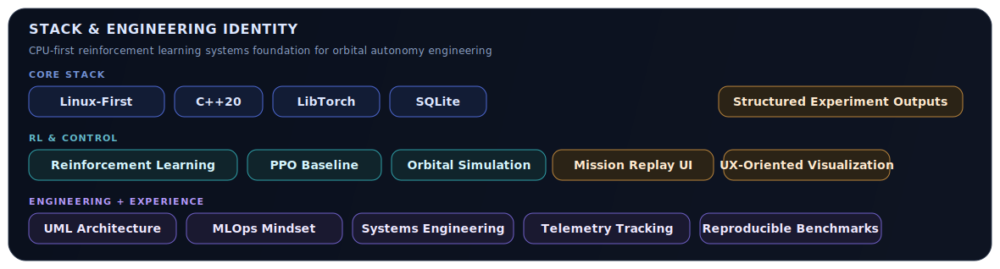

<p align="center">
  
</p>

# Orbital Neural Control CPP

**C++20 orbital autonomy engineering platform for PPO-based control, mission simulation, reproducible benchmarking, telemetry persistence, and extensible autonomy architecture.**

CPU-first by design. LibTorch on CPU is the active inference/training backend. MuJoCo is optional. TensorRT is architected as a future backend path and remains disabled by default.

## Stack and Engineering Identity

<p align="center">
  
</p>

<p align="center">
  
</p>

## Core Capabilities

- Orbital simulation baseline for continuous control experiments
- PPO actor-critic training/evaluation in C++20 + LibTorch (CPU)
- SQLite run/episode/event/benchmark persistence
- MLflow experiment tracking, artifact logging, and model registration path
- ONNX export pipeline for embedded-friendly inference deployment contracts
- Real-time backend telemetry stream (REST + WebSocket)
- Next.js mission dashboard with 3D orbit visualization and live charts
- UML-backed architecture documentation for maintainable evolution

## Why This Repository Exists

Most RL codebases optimize for short-lived experiments. This repository is built for long-lived autonomy engineering:

- deterministic and reproducible execution paths
- benchmarkable outputs and run manifests
- layered architecture with explicit boundaries
- extensibility toward orbital/satellite control domains

## Orbital Systems Vision

Near-term: robust PPO baseline for continuous-control simulation with reliable engineering workflows.

Long-term: mission-grade autonomy stack where orbital environments, telemetry pipelines, model-serving backends, and control safety constraints are developed under one coherent architecture.

## Architecture Overview

<p align="center">
  
</p>

Repository structure:

```text
src/                  # current production baseline (train/eval/benchmark CLI)
core/                 # orbital control core library (C++20)
control/              # baseline LQR/PID controllers for comparison
sim/                  # simulation perturbation abstractions
rl/                   # runtime/production mode and reproducibility primitives
training/             # Python orchestration + pybind11 bridge
mlops/                # MLflow tracking + ONNX export + registry scripts
backend/              # C++ WebSocket/REST telemetry service
frontend/             # Next.js 15 mission-control dashboard
config/               # reproducible train/eval/benchmark configs
docs/uml/             # component/class/sequence diagrams
```

Layering model:

- `domain`: PPO, environment contracts, inference abstraction
- `application`: train/eval/benchmark orchestration
- `infrastructure`: artifacts, persistence, reporting
- `interfaces`: CLI entrypoints
- `core/control/sim/rl`: orbital-focused expansion surface

## Mathematical Control Foundation

### PPO Objective with Clipping and Regularization

For trajectory samples \((s_t, a_t, r_t)\) generated under \(\pi_{\theta_{\text{old}}}\), the optimization target is:

$$
\max_{\theta} \; \mathcal{L}_{\text{PPO}}(\theta)
= \mathbb{E}_t\Big[
\min\big(r_t(\theta)\hat{A}_t,
\operatorname{clip}(r_t(\theta),1-\epsilon,1+\epsilon)\hat{A}_t\big)
- c_v\,\mathcal{L}_V(\theta)
+ c_e\,\mathcal{H}(\pi_\theta(\cdot\mid s_t))
\Big]
$$

with policy ratio

$$
r_t(\theta) = \frac{\pi_\theta(a_t\mid s_t)}{\pi_{\theta_{\text{old}}}(a_t\mid s_t)}.
$$

The value loss term is

$$
\mathcal{L}_V(\theta)=\big(V_\theta(s_t)-V_t^{\text{target}}\big)^2,
\qquad
V_t^{\text{target}}=\hat{A}_t+V_{\theta_{\text{old}}}(s_t).
$$

### Actor-Critic Decomposition (Continuous Gaussian Control)

The policy/value network shares an encoder and splits into actor/value heads:

$$
h_t = f_\theta(s_t),
\qquad
\mu_\theta(s_t)=W_\mu h_t+b_\mu,
\qquad
V_\theta(s_t)=W_V h_t+b_V.
$$

### GAE(\(\lambda\))

Temporal-difference residual:

$$
\delta_t = r_t + \gamma V_\theta(s_{t+1}) - V_\theta(s_t).
$$

Generalized advantage estimator:

$$
\hat{A}_t^{\text{GAE}(\lambda)}
= \sum_{l=0}^{T-t-1}(\gamma\lambda)^l\,\delta_{t+l}.
$$

Equivalent backward recursion used in implementation:

$$
\hat{A}_t = \delta_t + \gamma\lambda\,\hat{A}_{t+1}.
$$

This provides lower-variance gradients than Monte Carlo returns while preserving useful bias/variance control via \(\lambda\).

### Entropy Regularization

For diagonal Gaussian policy,

$$
\mathcal{H}(\pi_\theta(\cdot\mid s_t))
= \frac{1}{2}\sum_i\Big(1+\log(2\pi\sigma_{\theta,i}^2)\Big).
$$

Entropy pressure mitigates premature collapse, especially important in continuous orbital maneuvers where local minima can create brittle closed-loop behaviors.

### Adaptation to Orbital Continuous Control

The PPO stack is tuned for orbital-control constraints:

- clipped updates cap aggressive policy ratio shifts and reduce destructive control jumps
- Gaussian policy variance limits are explicitly bounded to prevent unstable thrust excursions
- advantage shaping is tied to mission residuals (position/velocity/control effort), not only sparse terminal reward
- deterministic runtime mode is available for production-like control loops

## Control-Theoretic Interpretation

PPO here is treated as a stochastic policy improvement layer over classical control intuition.

Given dynamics \(x_{t+1}=f(x_t,u_t)\), classical baselines (LQR/PID) provide deterministic stabilizing references, while PPO learns residual/adaptive control structure under disturbances and nonlinearities.

- **LQR link:** local quadratic stabilization around operating points motivates policy smoothness and state-cost shaping.
- **MPC link:** repeated finite-horizon updates resemble receding-horizon refinement, but with learned policy compression for runtime speed.
- **Lyapunov-style reasoning:** clipped policy updates and bounded action variance are used as practical safeguards so that closed-loop behavior avoids abrupt energy-increasing transitions. In candidate regions, one targets

$$
\Delta V_L(x_t) = V_L(x_{t+1}) - V_L(x_t) \lesssim 0
$$

under bounded stochastic perturbations and bounded control outputs.

This is not a formal global-stability proof, but it provides an engineering path to compare RL controllers against LQR/MPC references with explicit safety metrics.

## Training, Evaluation, Benchmark

Build baseline:

```bash
bash tools/setup_libtorch_cpu.sh
cmake --preset dev
cmake --build --preset build
```

Run:

```bash
./build/nmc train --env point_mass --seed 7 --updates 30 --run-id train_cpu_001
./build/nmc eval --checkpoint artifacts/latest/checkpoint.pt --episodes 10 --backend libtorch --run-id eval_cpu_001
./build/nmc benchmark --quick --name smoke --seed 7
```

Artifacts:

```text
artifacts/
  runs/<run_id>/manifest.json
  runs/<run_id>/training_metrics.csv
  runs/<run_id>/training_summary.json
  runs/<run_id>/evaluation_summary.json
  runs/<run_id>/checkpoints/policy_last.pt
  reports/
  benchmarks/latest.json
  latest/
  experiments.sqlite
```

## MLOps: MLflow + ONNX + Registry

Start tracking server:

```bash
python3 -m pip install -r mlops/requirements.txt
./mlops/start_mlflow.sh
```

Run tracked training:

```bash
python3 mlops/train_with_mlflow.py \
  --tracking-uri http://localhost:5000 \
  --experiment orbital_ppo \
  --run-id mlflow_orbital_001 \
  --seed 7 --updates 30 --num-envs 16 --env point_mass \
  --export-onnx
```

Tracking tags include mission-oriented metadata such as `orbital_dynamics`, `perturbation_level`, and `reward_shaping`.

## Realtime Mission Demo (Backend + Frontend)

Backend (C++): REST + WebSocket telemetry stream.

Frontend (Next.js 15 + TypeScript + Tailwind + shadcn/ui primitives + Recharts + React Three Fiber):

- 3D orbital scene with live trajectory
- reward/policy/orbit-residual charts
- stream connectivity and mission counters

## Full Demo in 3 Commands

```bash
docker compose up --build -d mlflow backend frontend
docker compose run --rm training
docker compose logs -f backend frontend
```

Open:

- Mission dashboard: `http://localhost:3000`
- Backend health: `http://localhost:8080/health`
- MLflow UI: `http://localhost:5000`

## CI and Reproducibility

CI validates a meaningful CPU-first baseline:

1. configure and build `nmc`
2. run smoke benchmark via CTest
3. verify benchmark/report/checkpoint artifacts exist
4. compile orbital core tests/benchmarks for architecture portability paths

Optional integrations remain guarded and do not destabilize baseline CI.

## UML and Engineering Docs

- `docs/architecture.md`
- `docs/uml/component-diagram.md`
- `docs/uml/class-diagram.md`
- `docs/uml/sequence-training.md`
- `docs/roadmap.md`

## Roadmap

- orbital dynamics fidelity upgrades (3DOF -> 6DOF mission profiles)
- disturbance models and safety envelope validation
- formalized RL vs LQR/MPC benchmark packs
- TensorRT inference backend integration (optional, future)
- embedded inference pipeline hardening (ARM targets)
