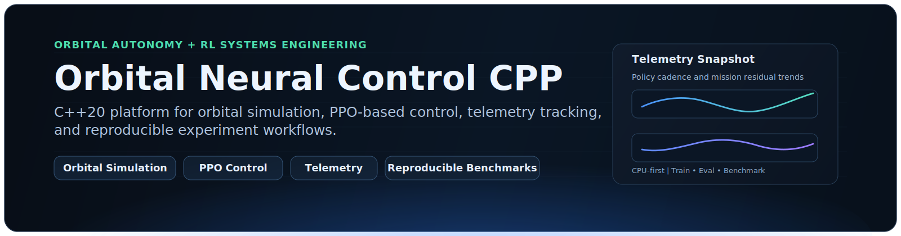
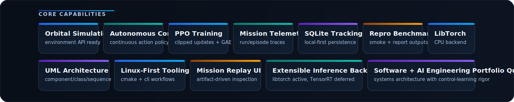

<p align="center">
  
</p>

# Orbital Neural Control CPP

**C++20 orbital autonomy engineering baseline for PPO control, reproducible experiments, telemetry persistence, and benchmarkable evaluation.**

`nmc` is the primary CLI binary (`train`, `eval`, `benchmark`). The project is CPU-first by default.

- Active backend: LibTorch (CPU)
- Optional integration: MuJoCo (`NMC_ENABLE_MUJOCO=ON`)
- Future path (stub only): TensorRT inference backend

Execution scope:

- baseline (implemented + CI-gated): `src/` runtime and `nmc`
- expansion modules (implemented, optional): `core`, `control`, `sim`, `rl`, `training`, `mlops`, `backend`, `frontend`
- roadmap (not shipped as baseline): higher-fidelity orbital dynamics and advanced autonomy stacks

## Stack and Engineering Identity

<p align="center">
  <span style="display:inline-flex; margin:8px 10px;"></span>
  <span style="display:inline-flex; margin:8px 10px;"></span>
  <span style="display:inline-flex; margin:8px 10px;"></span>
</p>

<p align="center">
  <span style="display:inline-flex; margin:8px 10px;"></span>
  <span style="display:inline-flex; margin:8px 10px;"></span>
</p>

<p align="center">
  <span style="display:inline-flex; margin:8px 10px;"></span>
</p>

<p align="center">
  <span style="display:inline-flex; margin:8px 10px;"></span>
  <span style="display:inline-flex; margin:8px 10px;"></span>
</p>

<p align="center">
  <span style="display:inline-flex; margin:8px 10px;"></span>
  <span style="display:inline-flex; margin:8px 10px;"></span>
</p>

<p align="center">
  <span style="display:inline-flex; margin:8px 10px;"></span>
  <span style="display:inline-flex; margin:8px 10px;"></span>
  <span style="display:inline-flex; margin:8px 10px;"></span>
</p>

<p align="center">
  <span style="display:inline-flex; margin:8px 10px;"></span>
  <span style="display:inline-flex; margin:8px 10px;"></span>
</p>

## Core Capabilities

<p align="center">
  
</p>

## Why This Repository Exists

Most RL repositories optimize for short-lived experiments. This repository optimizes for maintainable autonomy engineering

- layered C++ architecture with explicit boundaries
- reproducible train/eval/benchmark workflows
- deterministic smoke path for CI validation
- structured artifacts + SQLite persistence
- forward-compatible modules for orbital mission systems

## Quickstart

### 1. Bootstrap dependencies and build

```bash
cd <repo-root>
bash tools/setup_libtorch_cpu.sh
cmake --preset dev
cmake --build --preset build
./build/nmc help
```

### 2. Run smoke benchmark (CI-equivalent baseline)

```bash
./build/nmc benchmark --quick --name smoke_local --seed 7
```

### 3. Run train and eval

```bash
./build/nmc train --env point_mass --seed 7 --updates 30 --run-id train_cpu_001
./build/nmc eval --checkpoint artifacts/latest/checkpoint.pt --episodes 10 --backend libtorch --run-id eval_cpu_001
```

## Architecture

### Baseline Runtime (Implemented Today)

The executable baseline lives in `src/` and is intentionally layered. This is the path validated by CI.

- `src/domain/`: PPO, env contracts/adapters, inference backend abstraction, config objects
- `src/application/`: orchestration (`TrainingRunner`, `EvaluationRunner`, `BenchmarkRunner`)
- `src/infrastructure/`: artifacts, checkpoints, SQLite persistence, reporting
- `src/interfaces/`: CLI entrypoint and argument parsing
- `src/common/`: JSON/time/run-id helpers

### Expansion Modules (Optional, Not Required for Baseline Build)

Expansion modules are isolated from the baseline runtime:

- `core/`: orbital dynamics/control primitives
- `control/`: baseline LQR/PID controllers
- `sim/`: perturbation model interfaces
- `rl/`: runtime mode + reproducibility primitives
- `training/`: Python orchestration + pybind11 bridge
- `mlops/`: MLflow tracking + ONNX export + registry scripts
- `backend/`: C++ REST/WebSocket telemetry service
- `frontend/`: Next.js mission dashboard prototype

### Future Tracks (Roadmap)

- richer orbital dynamics and control safety validation
- tighter RL vs classical-control benchmark suites
- deployment/runtime hardening for embedded targets

See [Architecture Docs](docs/architecture.md) and UML under `docs/uml/`.

## Mathematical PPO Foundation

For samples collected under the previous policy \(\pi_{\theta_{\mathrm{old}}}\), the PPO objective used by the actor-critic loop is:

$$
\mathcal{L}_{\mathrm{PPO}}(\theta)=
\mathbb{E}_t\left[
\min\!\left(
r_t(\theta)\hat{A}_t,\,
\operatorname{clip}(r_t(\theta), 1-\epsilon, 1+\epsilon)\hat{A}_t
\right)
- c_v \mathcal{L}^{\mathrm{value}}_t(\theta)
+ c_e \mathcal{H}(\pi_\theta(\cdot \mid s_t))
\right]
$$

with importance ratio

$$
r_t(\theta)=
\frac{\pi_\theta(a_t \mid s_t)}
{\pi_{\theta_{\mathrm{old}}}(a_t \mid s_t)}
$$

and value target/loss

$$
\mathcal{L}^{\mathrm{value}}_t(\theta)=
\left(V_\theta(s_t)-V_t^{\mathrm{target}}\right)^2,\qquad
V_t^{\mathrm{target}}=\hat{A}_t+V_{\theta_{\mathrm{old}}}(s_t)
$$

Generalized Advantage Estimation (GAE) is computed from TD residuals:

$$
\delta_t = r_t + \gamma V(s_{t+1}) - V(s_t)
$$

$$
\hat{A}^{\mathrm{GAE}(\lambda)}_t
= \sum_{l=0}^{T-t-1}(\gamma\lambda)^l\,\delta_{t+l}
$$

Equivalent backward recursion used in implementation:

$$
\hat{A}_t=\delta_t + \gamma\lambda \hat{A}_{t+1}
$$

Continuous-control adaptation:

- Gaussian policy head with bounded log-std for stable stochastic control
- clipped ratio updates reduce destructive policy jumps
- reward/advantage shaping supports orbital residual objectives

## Reproducible Artifacts

Each run writes structured outputs under `artifacts/`:

```text
artifacts/
  runs/<run_id>/
    manifest.json
    training_metrics.csv
    training_summary.json
    evaluation_summary.json
    live_rollout.csv
    checkpoints/policy_last.pt
    checkpoints/policy_last.meta
  latest/
    manifest.json
    training_metrics.csv
    checkpoint.pt
    checkpoint.meta
  benchmarks/
    latest.json
    latest.csv
  checkpoints/
  reports/
  experiments.sqlite
```

## Persistence and Experiment Tracking

### SQLite (baseline runtime)

`src/infrastructure/persistence/sqlite_experiment_store.*` tracks:

- `runs`
- `episodes`
- `events`
- `benchmarks`

### MLflow + ONNX (optional MLOps track)

```bash
python3 -m pip install -r mlops/requirements.txt
./mlops/start_mlflow.sh
python3 mlops/train_with_mlflow.py --tracking-uri http://localhost:5000 --experiment orbital_ppo --run-id mlflow_orbital_001 --seed 7 --updates 30 --num-envs 16 --env point_mass --export-onnx
```

## CI Baseline

GitHub Actions validates a meaningful CPU-first path:

1. validate required baseline source set
2. configure with CI preset (`cmake --preset ci`)
3. build `nmc`
4. execute `nmc_smoke_benchmark` via CTest
5. verify required artifacts (`benchmark/latest`, `latest/manifest`, `latest/checkpoint`)
6. cross-compile orbital core tests for ARM64 portability

## Full Stack Demo (Optional)

```bash
docker compose up --build -d mlflow backend frontend
docker compose run --rm training
docker compose logs -f backend frontend
```

Endpoints:

- dashboard: `http://localhost:3000`
- backend health: `http://localhost:8080/health`
- MLflow: `http://localhost:5000`

## Documentation

- [docs/architecture.md](docs/architecture.md)
- [docs/build.md](docs/build.md)
- [docs/roadmap.md](docs/roadmap.md)
- [docs/uml/component-diagram.md](docs/uml/component-diagram.md)
- [docs/uml/class-diagram.md](docs/uml/class-diagram.md)
- [docs/uml/sequence-training.md](docs/uml/sequence-training.md)
- [CONTRIBUTING.md](CONTRIBUTING.md)
- [CHANGELOG.md](CHANGELOG.md)

## Current Status vs Roadmap

Implemented now:

- production baseline CLI (`nmc`) with train/eval/benchmark
- reproducible artifact model and checkpoint flow
- SQLite persistence for runs/episodes/events/benchmarks
- CI smoke validation and ARM64 core cross-compile path
- optional orbital expansion modules (`core/control/sim/rl`, backend/frontend, mlops)

Deferred intentionally:

- CUDA acceleration
- active TensorRT runtime dependency
- full 6DOF mission dynamics in baseline CLI
