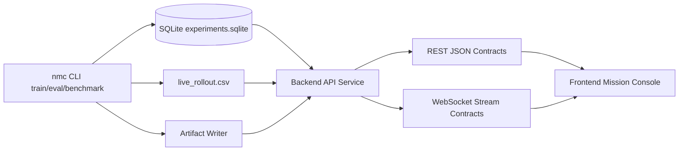

# System Dataflow

## Why this Design

- Baseline runtime (`nmc`) keeps deterministic training/eval/benchmark as the source of truth.
- Backend reads persisted artifacts instead of owning simulator state.
- Frontend consumes typed contracts generated from OpenAPI to avoid ad hoc payload drift.
- Replay and live visualizations share telemetry schema for consistent operational tooling.
