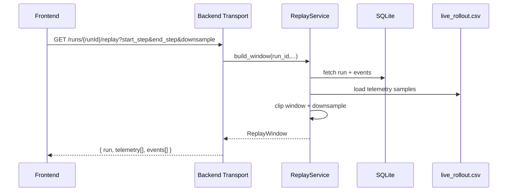
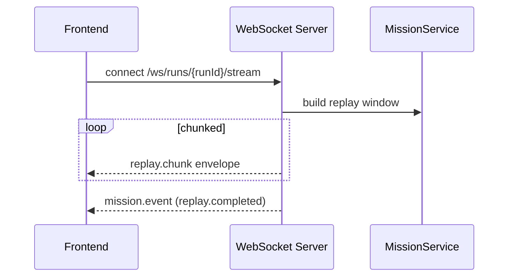

# Mission Replay Pipeline

This repository supports two replay data paths:

1. **Persisted replay** (`GET /runs/{runId}/replay`)
2. **Stream replay** (`WS /ws/runs/{runId}/stream`)

## Replay Sequence

## Streaming Sequence

## Frontend Modes

- **Replay mode**: uses `GET /runs/{runId}/replay`.
- **Live mode**: uses WebSocket stream and progressively appends telemetry samples.

Both modes are rendered through the same timeline and orbital viewport primitives to keep interaction semantics consistent.
