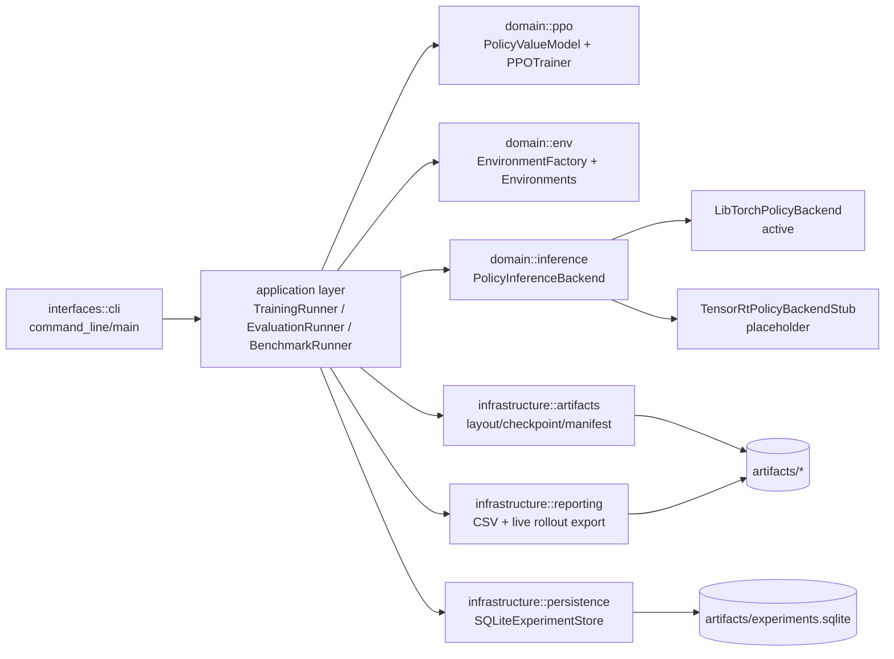

# Component Diagram

```mermaid
flowchart LR
    CLI[interfaces::cli\ncommand_line/main] --> APP[application layer\nTrainingRunner / EvaluationRunner / BenchmarkRunner]

    APP --> PPO[domain::ppo\nPolicyValueModel + PPOTrainer]
    APP --> ENV[domain::env\nEnvironmentFactory + Environments]
    APP --> INF[domain::inference\nPolicyInferenceBackend]

    APP --> ART[infrastructure::artifacts\nlayout/checkpoint/manifest]
    APP --> DB[infrastructure::persistence\nSQLiteExperimentStore]
    APP --> REP[infrastructure::reporting\nCSV + live rollout export]

    INF --> LIBTORCH[LibTorchPolicyBackend\nactive]
    INF --> TRTSTUB[TensorRtPolicyBackendStub\nplaceholder]

    DB --> SQLITE[(artifacts/experiments.sqlite)]
    ART --> FS[(artifacts/*)]
    REP --> FS
```
