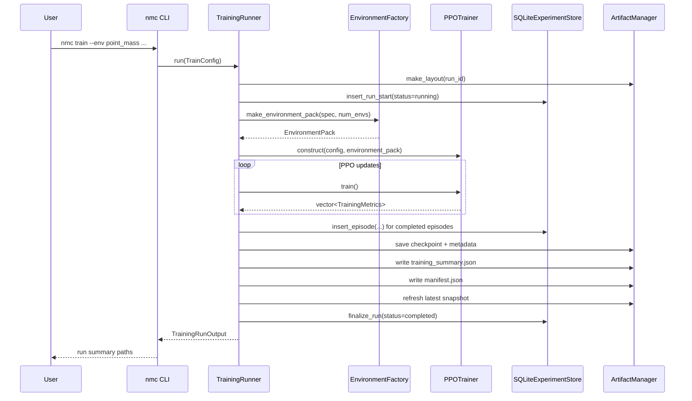

# Training Sequence

```mermaid
sequenceDiagram
    participant User
    participant CLI as nmc CLI
    participant TR as TrainingRunner
    participant EF as EnvironmentFactory
    participant PT as PPOTrainer
    participant DB as SQLiteExperimentStore
    participant ART as ArtifactManager

    User->>CLI: nmc train --env point_mass ...
    CLI->>TR: run(TrainConfig)
    TR->>ART: make_layout(run_id)
    TR->>DB: insert_run_start(status=running)
    TR->>EF: make_environment_pack(spec, num_envs)
    EF-->>TR: EnvironmentPack
    TR->>PT: construct(config, environment_pack)

    loop PPO updates
        TR->>PT: train()
        PT-->>TR: vector<TrainingMetrics>
    end

    TR->>DB: insert_episode(...) for completed episodes
    TR->>ART: save checkpoint + metadata
    TR->>ART: write training_summary.json
    TR->>ART: write manifest.json
    TR->>ART: refresh latest snapshot
    TR->>DB: finalize_run(status=completed)
    TR-->>CLI: TrainingRunOutput
    CLI-->>User: run summary paths
```
